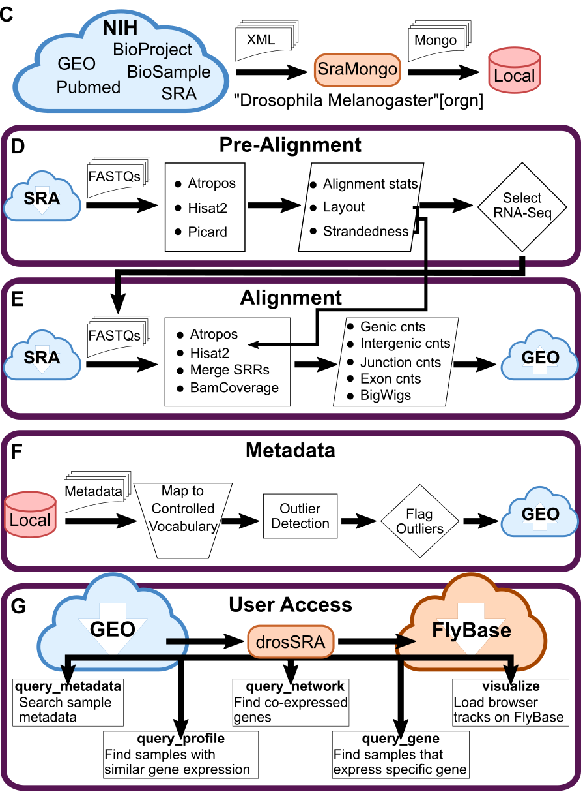

# DrosSRA Workflow

## Objectives

- Make Drosophila public RNA-Seq data easier to access
- Normalize sample annotations for easier discovery
- Create a gene expression atlas across stages and tissues
- Provide necessary data for quick preliminary analysis
- Have all data available through GEO [GSE117217](https://www.ncbi.nlm.nih.gov/geo/query/acc.cgi?acc=GSE117217)
- Have data easier to access through the [drosSRA](https://github.com/jfear/drosSRA) CLI (WORK IN PROGRESS)

## Outline



1. Use `SraMongo` to download associated metadata for all *Drosophila melanogaster* samples
2. The Pre-Alignment workflow pre-processes all samples to automatically discover/validate technical metadata associated with each sample.
3. The Alignment workflow process all RNA-Seq samples that pass filtering to generate coverage counts and genomic browser tracks.
4. The Metadata workflow normalizes biological metadata to FlyBase controlled vocabulary.
5. All data is accessible directly from GEO. We are also developing a command line tool `drosSRA` to allow users to easily access the data and perform different types of queries. Finally, we provide genome browser visualization through the FlyBase JBRowse instance.

## Setup

This project uses a set snakemake workflows. The snakemake workflows run in a pre-built singularity container which has all of the required software.

To run the singularity container you need to have [singulairty](https://sylabs.io/guides/3.5/user-guide/quick_start.html#quick-installation-steps), [mongoDB](https://www.mongodb.com/download-center/community), and [miniconda](https://docs.conda.io/en/latest/miniconda.html) installed.

To create the running environment run.

```bash
$ conda env create --file environment.yaml
```

### Environmental Variables

This project makes use of the following environmental variables.

```
export SLACK_SNAKEMAKE_BOT_TOKEN=<secret>
export ENTREZ_API_KEY=<secret>

export PROJECT_PATH=<absolute path to where folder is cloned>
export SINGULARITY_IMG=$PROJECT_PATH/singularity/drosSRA_workflow.sif
export SINGULARITY_BINDPATH=<list of paths that need mounted in the singularity container>
export SLURM_JOBID=<optional, used to make temp directories on /lscratch>
export TMPDIR=<optional, used to make temp directories>

```
### Development

For development I have some extra packages that are useful.

```bash
$ conda env update -n drosSRA_workflow --file environment_dev.yaml
```

It is also helpful to pip install the two python packages that are distributed as part of this project.

```bash
$ conda activate drosSRA_workflow
[drosSRA_workflow] $ pip install -e src/
[drosSRA_workflow] $ pip install -e biometa-app/
```

## Project Overview

### Initialization workflow `./Snakefile`

This workflow runs `SraMongo` and builds a list of all SRXs and thier SRRs
(`./output/srx2srr.csv`). 

**NOTE 1:** `SraMongo` requires an environment variable `$ENTREZ_API_KEY` to be set. This API key can be generated following these directions [here](https://ncbiinsights.ncbi.nlm.nih.gov/2017/11/02/new-api-keys-for-the-e-utilities/).

**NOTE 2:** The majority of workflows only need the `./output/srx2srr.csv` they do not require the local `mongoDB`. I am not able to have an always on instance of `mongoDB` on our cluster, so workflows that are typically run on a the cluster (`./prealn-wf/Snakefile` and `./rnaseq-wf/Snakefile`) do not need access.

### FASTQ Download sub-workflow `./fastq-wf/Snakefile`

This workflow downloads FASTQ data from the SRA and checks that the download was sucessful. It was initially designed as a subworkflow, but `snakemake` was not running groups correctly with subworkflows. Currently, I just pull the rules from this workflow into `./prealn-wf/Snakefile` and `./rnaseq-wf/Snakefile`.

### Pre-Alignment workflow `./prealn-wf/Snakefile`

This workflow downloads FASTQs for all samples and generates various QC features describing each sample.

### Library Strategy workflow `./library_strategy-wf/Snakefile`

This workflow runs outlier detection on the RNA-Seq samples. It creates a golden set of RNA-Seq samples to proceed with.

### Alignment workflow `./rnaseq-wf/Snakefile`

This is the meat of the project. It provides all deliverables.

### Metadata workflow (WIP)

I am currently working on this section. I am hand normalizing samples using a web app to assist me `./biometa-app`. Once this is done I will build up the outlier detection for each discrete group.

## Deprecated Workflows

I am in the middle of a major refactoring to simply the project. The following workflows are deprecated or broken.

- `./agg-rnaseq-wf`
- `./aln-downstream-wf`
- `./aln-wf`: This old alignment workflow.
- `./geo-wf`: This is the workflow to put together the data currently upload to geo. It included biological metadata processing.
- `./stranded-bigwig-wf`: This is the workflow used to generate the current aggregated track up on FlyBase.
- `./ovary-rnaseq-wf`: Pulled out ovary data for another project.
- `./testis-rnaseq-pe-wf`, `./testis-rnaseq-stranded-wf`, `./testis-rnaseq-wf`: I was working on annotating the testis transcriptome. This part of the project became too large for our current scope so has been moved to a separate project.
